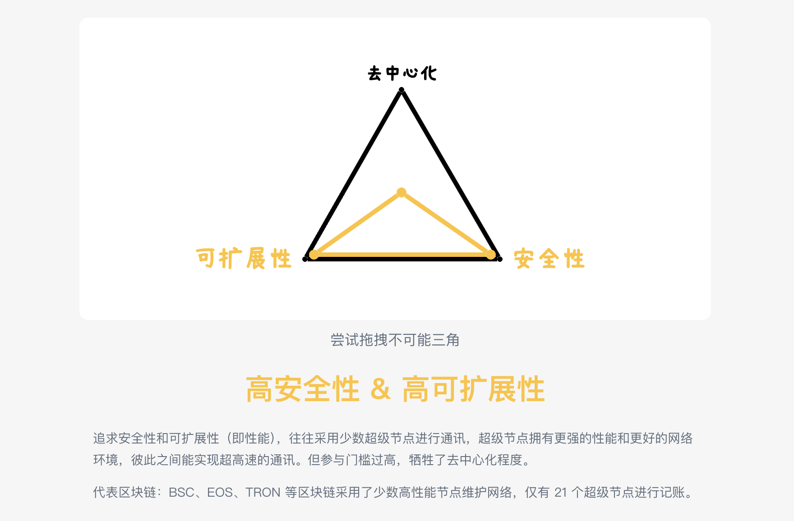
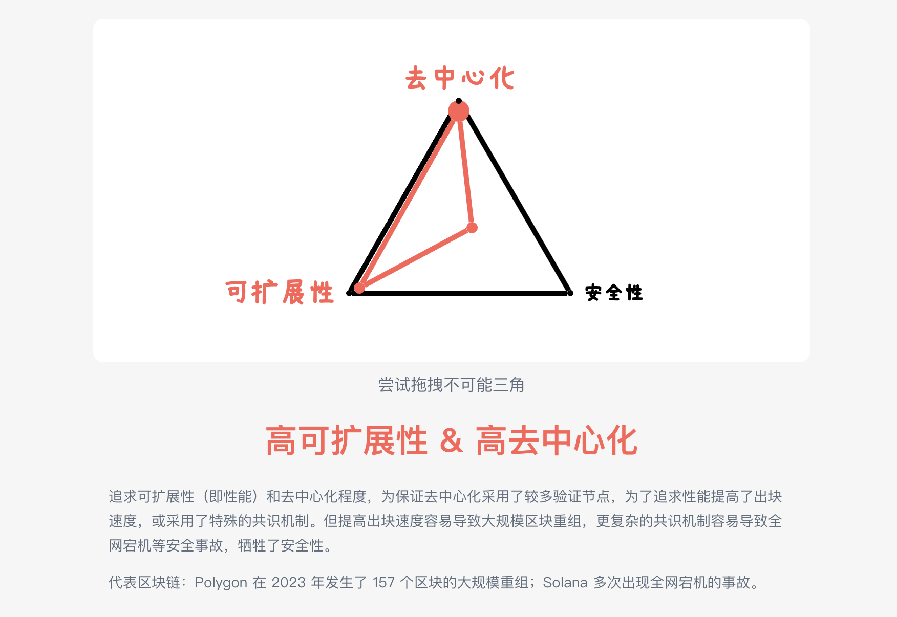

# 1.2 区块链的不可能三角

由于区块链的底层特性，存在一个不可能三角悖论。区块链不可能三角（Blockchain Trilemma）是指在设计区块链系统时，存在三个目标之间的矛盾，这三个目标分别是去中心化、安全性和可扩展性（性能）。

1. 去中心化（Decentralization）：指的是在区块链系统中，所有的节点都具有相同的权力，没有单一的中心化权威节点进行控制。这个目标是区块链的核心特性，也是保证系统安全性和抗攻击性的基础。

2. 安全性（Security）：指的是在区块链系统中，保证交易的真实性、完整性、不可篡改性和抗攻击性等方面的安全。这个目标是区块链系统的重要保障，也是确保系统可靠性和信任度的基础。

3. 可扩展性（Scalability）：可扩展性即性能，指的是在区块链系统中，支持足够大量的交易、节点和用户等系统扩展。这个目标是区块链系统的重要需求，也是确保系统能够满足现实需求的基础。

这三个目标之间存在矛盾关系。例如，在追求更高的去中心化的情况下，需要所有节点都保存完整的区块链数据，但是这会导致系统的可扩展性降低。相反，在追求更高的可扩展性的情况下，需要牺牲一定的去中心化；还比如采用分片技术 [1] 来扩容，但是可能导致节点同步数据困难，更容易发生故障，导致安全性降低。

任何一个区块链系统在设计时都需要在这三个目标之间进行平衡取舍，优化其中一个目标很可能导致牺牲其他目标的部分性能。这使得区块链系统在 Layer 1 层横向做改进时遇到了难以逾越的障碍，那么，**有没有办法绕过区块链不可能三角呢？**

&nbsp;

## 注释及拓展阅读

[1] 分片技术早于区块链的出现，在传统数据库中已有运用，主要用于大型商业数据库的优化。其理念就是将数据库中的数据，切割成很多数据分片，再将这些分片分配到不同的服务器中储存，面对大规模使用请求时，可以避免单一服务器压力过大的问题。

分片技术用于区块链中，也可以分担短时间内的大量交易，达到扩容的目的。但这同时也伴随着更多新的问题：

1. 不同分片之间的通讯问题
2. 每个分片不再保存全部交易记录，导致信息同步问题
3. 分片之后验证算力被分散，提高了 51% 攻击的风险

每个问题都要求额外的机制来解决，使得整体共识机制变得更加复杂。

以太坊最新分片技术路线：[Danksharding (ethereum.org)](https://ethereum.org/en/roadmap/danksharding/)
